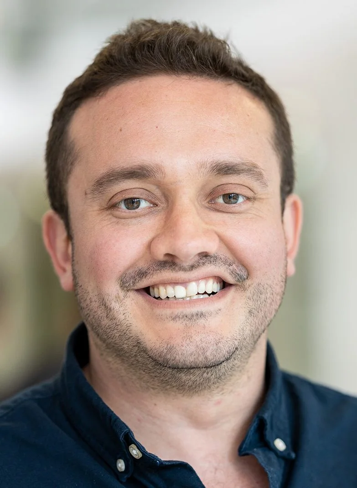
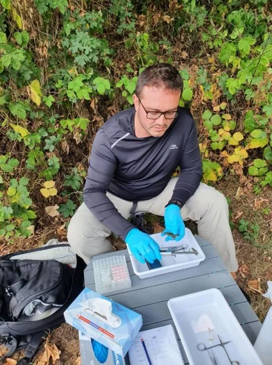
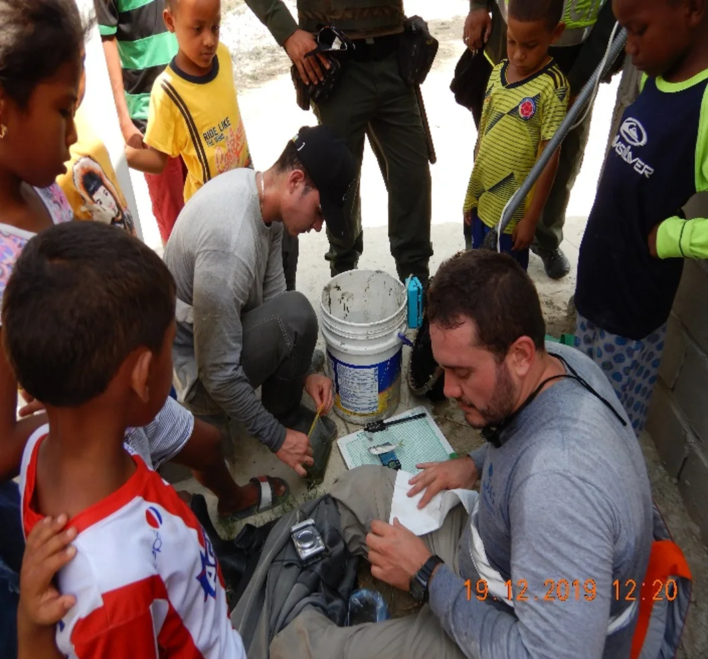
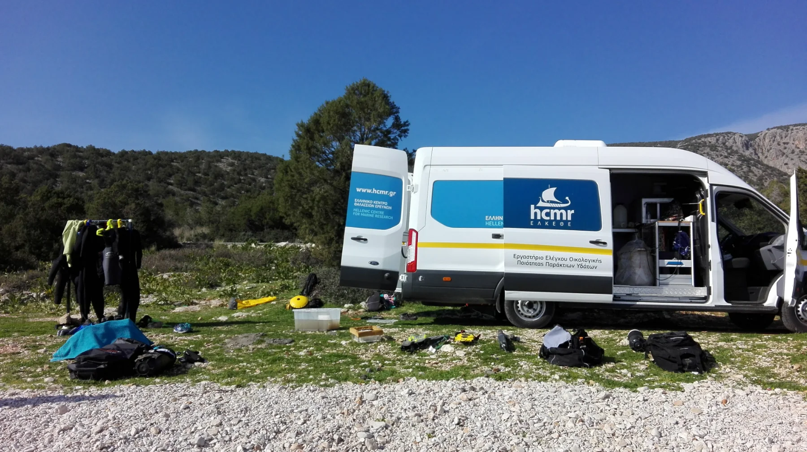

::: {.about-current}
::: {.about-current-copy}
## Current role

I am a **Postdoctoral Researcher and Lecturer** in the Molecular Ecotoxicology Group at the Institute for Environmental Research (IfER), RWTH Aachen University, Germany. My work connects aquatic organisms and field-realistic environmental gradients with molecular ecology, integrative eco-omics and questions of biological organisation and resilience.

[RWTH profile](https://www.ifer.rwth-aachen.de/cms/ifer/der-lehrstuhl/team/~bhigka/mitarbeiter-pvz-/?gguid=PER-JZW92L6&allou=1)
:::

::: {.about-current-photo}
{fig-alt="Portrait of Camilo Escobar-Sierra."}
:::
:::

## Scientific trajectory

My research trajectory has progressively integrated field, molecular and computational approaches to understand how environmental stress affects biological systems from molecular responses to organismal performance and ecological change.

In **Colombia**, I trained in biology and ichthyology, freshwater ecology, biodiversity and applied aquatic science. My early work examined fish and shrimp communities in tropical streams and how they responded to environmental drivers across spatial scales.

During the **Erasmus Mundus ACES MSc**, I worked across marine ecology, aquaculture impacts and environmental management. Research on grazer–macroalgal interactions introduced me to integrating omics approaches with ecological questions.

My **PhD at the University of Cologne** focused on fish stress physiology, transcriptomics and multiple environmental stressors. Field transcriptomics connected molecular responses with environmentally realistic conditions and established the foundation for my current work.

At **RWTH Aachen University**, I have expanded this trajectory into integrative eco-omics, non-model organism resources, microbiomes and metagenomics, genomics, reproducible analysis and systems-level questions of biological resilience.

::: {.photo-strip}
::: {.photo-strip-item .photo-strip-item--fish}
{fig-alt="Processing aquatic samples during fieldwork."}
:::

::: {.photo-strip-item .photo-strip-item--group}
{fig-alt="Group gathered around aquatic field sampling and field equipment."}
:::

::: {.photo-strip-item .photo-strip-item--campaign}
{fig-alt="Field vehicle and sampling equipment at a mountain research site."}
:::
:::

## Academic roots

My research developed through several complementary scientific traditions that continue to shape the questions and methods I use today.

::: {.academic-roots}
::: {.academic-root}
### BSc — [Juan Felipe Blanco-Libreros](https://www.udea.edu.co/wps/portal/udea/web/inicio/investigacion/areas-investigacion/inicio-fichas-en/fichas/faculty-exact-natural-sciences/elice-lotic-ecology-islands-coasts-and-estuaries)

Field ecology · fish communities · multiscale environmental drivers

Universidad de Antioquia
:::

::: {.academic-root}
### MSc — [Eugenia Apostolaki](https://io.hcmr.gr/member-page-2/?memberid=apostolakie)

Marine ecology · aquaculture impacts · first integration of omics with ecological questions

ACES Erasmus Mundus
:::

::: {.academic-root}
### PhD — [Kathrin Lampert](https://zoologie.uni-koeln.de/en/arbeitsgruppen/ag-lampert/inhalt/staff/prof-dr-kathrin-lampert)

Multiple stressors · transcriptomics · molecular ecology · scientific independence

University of Cologne
:::

::: {.academic-root}
### Postdoctoral research — [Pedro Inostroza](https://rwthcontacts.rwth-aachen.de/person/PER-3HVTSUA)

Ecotoxicogenomics · integrative eco-omics · mentoring · academic independence

RWTH Aachen University
:::
:::

## Teaching and mentoring

Teaching and researcher development are core parts of my academic work. At RWTH Aachen University I contribute to undergraduate and graduate teaching in Limnology, Data Science, Molecular Ecotoxicology, Introduction to Environmental Sciences and interdisciplinary seminars. Earlier in my career, I taught River Ecology at Universidad de Antioquia.

I mentor BSc, MSc and PhD researchers in experimental design, bioinformatics, transcriptomics, ecotoxicogenomics and multi-omics interpretation. My approach emphasises scientific ownership, methodological rigour and reproducible analysis. I want researchers to understand the analytical decisions behind their results, connect field, experimental and computational work, and become increasingly independent in how they frame and solve scientific problems.

## Building the next stage

I am using the next stage of my career to continue growing toward scientific independence and to consolidate a research programme I can carry forward. That means developing my own research questions, competing for funding, leading projects, mentoring researchers and building durable collaborations around environmental stress and biological resilience.

I am open to advanced postdoctoral or fellowship positions, tenure-track appointments and early group-leader roles that provide room for that development.

My long-term goal is to establish and fund an interdisciplinary research group focused on biological organisation and resilience under environmental stress, while training researchers in integrative, problem-driven aquatic biology.

## Academic service

My academic service includes peer review for journals across environmental science, ecology, ecotoxicology and fish biology, alongside conference presentations, invited seminars and international collaboration.

## Profiles

[Academic CV](https://miloes114.github.io/miloes114-academic-cv/Camilo_Escobar_Sierra_Academic_CV.pdf) 
[LinkedIn](https://www.linkedin.com/in/camilo-escobar-sierra-a17973116/) 
[GitHub](https://github.com/miloes114)  
[ORCID](https://orcid.org/0000-0001-9105-4378)  
[Google Scholar](https://scholar.google.com/citations?user=MZuNEEoAAAAJ&hl=en)  
[ResearchGate](https://www.researchgate.net/profile/Camilo-Escobar-Sierra)  
[RWTH Aachen](https://www.ifer.rwth-aachen.de/cms/ifer/der-lehrstuhl/team/~bhigka/mitarbeiter-pvz-/?gguid=PER-JZW92L6&allou=1)

## Contact

For research collaborations, scientific exchange or teaching-related enquiries, please use my institutional profile:

[RWTH Aachen profile](https://www.ifer.rwth-aachen.de/cms/ifer/der-lehrstuhl/team/~bhigka/mitarbeiter-pvz-/?gguid=PER-JZW92L6&allou=1)
