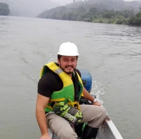
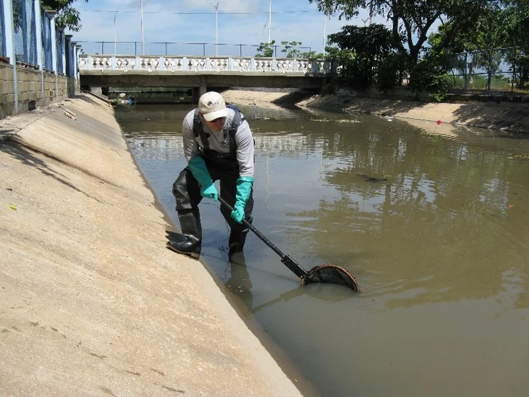
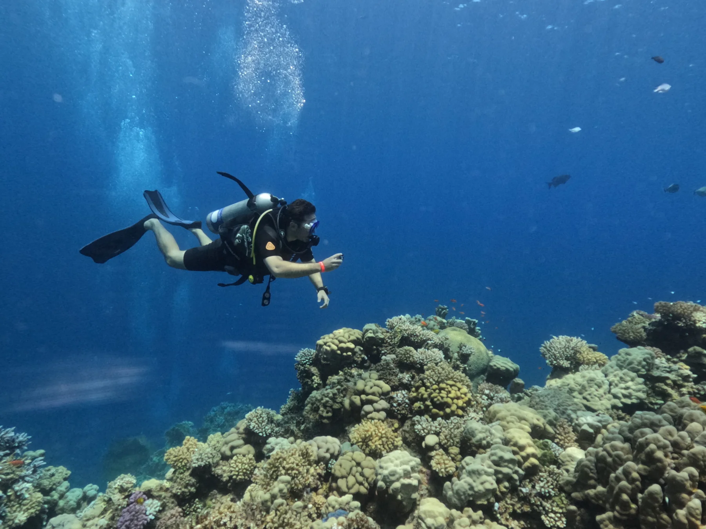

Mi investigación se sitúa en la intersección de la **ecología molecular, la biología del estrés ambiental, la ecología de sistemas y las eco-ómicas integrativas**. Estudio cómo el estrés ambiental afecta a los sistemas biológicos, desde las respuestas moleculares hasta el desempeño de los organismos y el cambio ecológico, y cuándo las respuestas adaptativas comienzan a fallar.

Trabajo principalmente con organismos, comunidades y holobiontes acuáticos. Los gradientes ambientales en condiciones reales proporcionan la base empírica para preguntas que abordo cada vez más a través de capas moleculares, microbianas, fisiológicas y ecológicas.

::: {.photo-strip .research-photo-strip}
::: {.photo-strip-item .photo-strip-item--boat}
{fig-alt="Trabajo de campo en un río desde una embarcación pequeña."}
:::

::: {.photo-strip-item .photo-strip-item--stream}
{fig-alt="Muestreo con red en un sistema acuático urbano."}
:::

::: {.photo-strip-item .photo-strip-item--reef}
{fig-alt="Buceo sobre un arrecife de coral."}
:::
:::

## Estrés ambiental en condiciones reales {#real-world-environmental-stress}

Los organismos en la naturaleza están expuestos a mezclas de estresores químicos y no químicos que varían en el espacio y el tiempo. Utilizo **gradientes de campo y escenarios de exposición ambientalmente realistas** para estudiar estas respuestas dentro de su complejidad ecológica.

Mi trabajo doctoral se centró en peces de agua dulce expuestos a múltiples estresores antropogénicos en ríos urbanos. Esto incluyó transcriptómica *de novo* aplicada en campo y RNA-seq comparativo multitejido para resolver respuestas moleculares a la salinización del agua dulce y a condiciones ambientales complejas.

Más recientemente, he ampliado este trabajo a macroinvertebrados de agua dulce y otros sistemas de vertebrados, conectando química ambiental con patrones de respuesta molecular y análisis ecotoxicogenómicos reproducibles.

A través de estos estudios me interesa identificar **qué procesos biológicos responden, cómo difieren las respuestas entre tejidos o taxones y qué implican esas respuestas para la condición del organismo y el riesgo ecológico**.

## Organización biológica y resiliencia {#biological-organisation-and-resilience}

Mi programa de investigación emergente se centra en la **organización biológica y la resiliencia bajo estrés ambiental**. Me interesa cómo el estrés modifica la coordinación entre capas moleculares, microbianas, fisiológicas y del organismo, y dónde las respuestas compensatorias comienzan a perder su capacidad de mantener el desempeño biológico.

Estoy desarrollando la **Hierarchical Stress Gradient Hypothesis (Hi-SGH)** como un marco comprobable para esta pregunta. La hipótesis de trabajo plantea que un aumento del estrés puede inicialmente reforzar la organización compensatoria y la coordinación, mientras que el incremento de los costos biológicos puede conducir finalmente a comportamientos de umbral y a una pérdida de coherencia o resiliencia.

### Arquitectura conceptual de Hi-SGH

<ol class="stress-gradient-map" aria-label="Arquitectura conceptual propuesta de la Hierarchical Stress Gradient Hypothesis">
  <li><strong>Estrés ambiental</strong></li>
  <li><strong>Organización compensatoria</strong></li>
  <li><strong>Coordinación y costo biológico</strong></li>
  <li><strong>Posible comportamiento de umbral</strong></li>
  <li><strong>Posible pérdida de coherencia o resiliencia</strong></li>
</ol>

Poner a prueba este patrón a lo largo de gradientes de estrés en condiciones reales ofrece una vía para entender cuándo la reorganización adaptativa da paso a la pérdida de resiliencia.

## Eco-ómicas integrativas {#integrative-eco-omics}

La transcriptómica ha sido una parte central de mi trabajo desde el doctorado. Mi investigación actual amplía esta base mediante:

- proteómica e integración multi-ómica;
- microbiomas asociados al hospedador y metabarcoding;
- metagenómica bacteriana y viral;
- recursos genómicos y transcriptómicos para organismos no modelo;
- variables fisiológicas e histopatológicas;
- química ambiental y gradientes ecológicos espaciales.

El objetivo es conectar patrones moleculares y microbianos con la condición del organismo, su desempeño y su contexto ecológico, y desarrollar una visión más integrada de las respuestas al estrés a través de distintas capas biológicas.

Esto es especialmente relevante para organismos acuáticos no modelo, donde las limitaciones de anotación, la disponibilidad desigual de recursos de referencia y los diseños de campo complejos condicionan lo que puede inferirse de los datos moleculares.

## Bioinformática ambiental reproducible

Los datos de campo y los organismos no modelo plantean de forma recurrente desafíos de anotación, procedencia y reproducibilidad. Desarrollo flujos de trabajo que hacen explícitas las decisiones analíticas y mantienen los resultados conectados con la evidencia biológica subyacente.

Mi enfoque prioriza:

**Trazabilidad.** Los resultados analíticos mantienen su relación con la evidencia experimental.

**Reproducibilidad.** El código, los entornos, los límites de los datos y los puntos de decisión se documentan para que los análisis puedan reproducirse y auditarse.

**Interpretabilidad biológica.** Los resultados funcionales y estadísticos se organizan de acuerdo con la fuerza y el contexto de la evidencia subyacente.

**Transferibilidad.** Los flujos de trabajo se diseñan para poder reutilizarse entre organismos y proyectos, conservando los supuestos biológicos relevantes.

EchoGO surgió de este enfoque, y los mismos principios guían mi trabajo actual en genómica, transcriptómica, metagenómica y compendios reproducibles de investigación.

## Hacia dónde se dirige esta investigación

Mi objetivo a largo plazo es conectar:

**exposición ambiental → respuesta molecular y microbiana → organización biológica → condición y desempeño del organismo → resiliencia → consecuencia ecológica**

Los sistemas de agua dulce y costeros ofrecen gradientes particularmente útiles para desarrollar y poner a prueba estas preguntas en condiciones reales.

Quiero que este programa ayude a aclarar cómo los sistemas biológicos mantienen su función bajo presión, cómo se organizan las respuestas compensatorias entre distintas capas y dónde esas respuestas comienzan a fallar.
