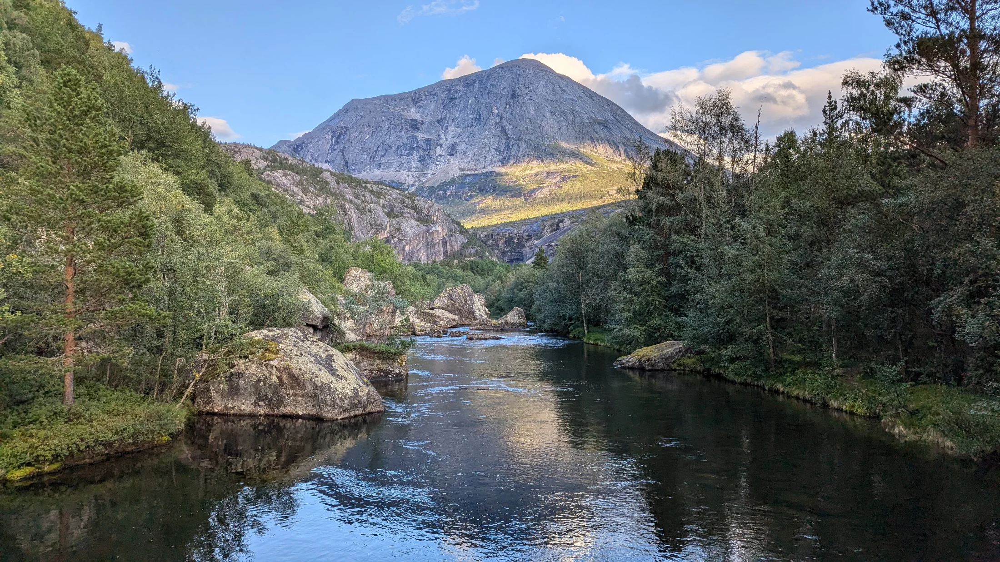

::: {.hero}
::: {.hero-copy}
## Understanding biological organisation and resilience under environmental stress

My research asks how environmental stress affects biological systems from molecular responses to organismal performance and ecological change, and when adaptive responses begin to fail.

I combine field-realistic environmental gradients with molecular ecology, integrative eco-omics and computational approaches to connect biological mechanisms with organismal performance and ecological consequences. I work primarily with aquatic organisms, communities and holobionts.

[Explore the research](research.qmd){.btn .btn-primary}
[Academic CV](https://miloes114.github.io/miloes114-academic-cv/Camilo_Escobar_Sierra_Academic_CV.pdf){.btn .btn-outline-secondary}
:::

::: {.hero-side}
### Current position

**Postdoctoral Researcher & Lecturer** 
Institute for Environmental Research (IfER), RWTH Aachen University
:::
:::

::: {.home-landscape}
{fig-alt="Forested mountain river beneath a rocky peak."}
:::

---

## Three connected research dimensions

Together, these dimensions frame my research programme.

::: {.research-grid}
::: {.research-card}
### Real-world environmental stress

Field gradients and environmentally realistic exposures help reveal how chemical mixtures, salinisation and other co-occurring pressures affect organisms under ecological complexity.

[Read more →](research.qmd#real-world-environmental-stress)
:::

::: {.research-card}
### Biological organisation and resilience

I ask how stress changes coordination among molecular, microbial, physiological and organismal layers, and where compensatory responses begin to fail.

[Read more →](research.qmd#biological-organisation-and-resilience)
:::

::: {.research-card}
### Integrative eco-omics

I increasingly connect transcriptomics with microbiome, metagenomic, proteomic, genomic, physiological and ecological information to interpret responses across biological layers.

[Read more →](research.qmd#integrative-eco-omics)
:::
:::

::: {.cross-cutting}
Across these questions, I develop reproducible workflows and resources for complex and non-model biological systems, with emphasis on traceability, biological interpretation and reusable computation.
:::

::: {.research-programme-map role="group" aria-labelledby="research-programme-title"}
### A conceptual map of the research programme {#research-programme-title}

The map follows how I connect environmental gradients with biological responses, cross-layer organisation, resilience and ecological consequences.

<ol class="programme-map" aria-label="Conceptual organisation of the research programme">
  <li><strong>Environmental stressors &amp; gradients</strong>Field ecology · environmental chemistry</li>
  <li><strong>Molecular, microbial &amp; physiological responses</strong>Transcriptomics · microbiome · physiology</li>
  <li><strong>Cross-layer biological organisation</strong>Multi-omics · networks · coordination</li>
  <li><strong>Compensation &amp; resilience</strong>Buffering · thresholds · performance</li>
  <li><strong>Ecological consequences</strong>Organismal condition · ecological interpretation</li>
</ol>
:::

---

## Selected work

::: {.project-strip}
::: {.project-mini}
**EchoGO**  
A reproducible framework for annotation-context-aware functional interpretation in non-model transcriptomics.

[GitHub](https://github.com/miloes114/EchoGo) · [Zenodo](https://doi.org/10.5281/zenodo.17660708)
:::

::: {.project-mini}
**Holtemme Gammarus Ecotoxicogenomics**  
A reproducible research compendium linking micropollutant gradients with transcriptomic and network responses in wild *Gammarus pulex*.

[GitHub](https://github.com/miloes114/holtemme-gammarus-ecotoxicogenomics)
:::

::: {.project-mini}
**Emerging research programme**  
Integrating molecular, microbial, physiological and ecological information to study biological organisation, compensation and resilience loss under environmental stress.

[Research vision](research.qmd#biological-organisation-and-resilience)
:::
:::

---

## A trajectory grounded in organisms and field ecology

My research trajectory has progressively integrated **field, molecular and computational approaches** around questions of environmental stress. It began in ichthyology, freshwater ecology and applied aquatic science in Colombia, developed through fish stress physiology and field transcriptomics, and now extends into integrative eco-omics and systems-level questions of resilience.

[About me](about.qmd) · [Selected publications](publications.qmd)

---

## Follow the research

Current project updates, conference activity and work in progress are shared through professional channels.

[LinkedIn](https://www.linkedin.com/in/camilo-escobar-sierra-a17973116/) · [GitHub](https://github.com/miloes114) · [Academic CV](https://miloes114.github.io/miloes114-academic-cv/Camilo_Escobar_Sierra_Academic_CV.pdf)
